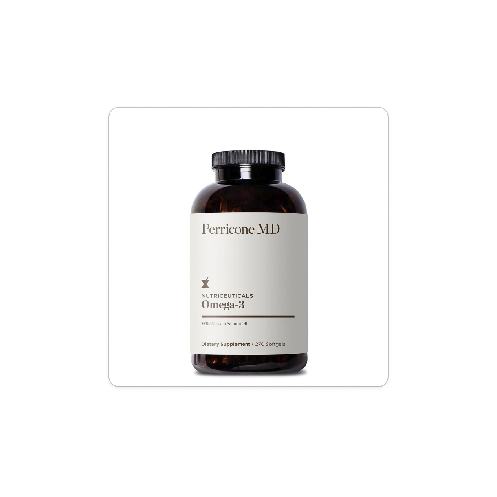

# Project Documentation for Lillian Jensen

## Project Summary
For this project, my contribution was the content of the entire body, including the grid that contains all the example products that were listed and the three information boxes at the bottom of the page. I was also in charge of assigning people their roles of the project and making sure everything was done correctly.

## Code Descriptions
> code example 1: This is the first line of products on the page. 
```
<div class="product-line">
        <div class="products">
          
          <p>Vitamin C</p>
        </div>

        <div class="products">
          
          <p>Vitamin B</p>
        </div>

        <div class="products">
          
          <p>Zinc</p>
        </div>

        <div class="products">
          
          <p>Magnesium</p>
        </div>

        <div class="products">
          
          <p>Omega 3</p>
        </div>
      </div>
    </section>

```
> Code ex 2: I added the href to take you to the specific id of where I wanted to nav bar to scroll down to when clicked on.
```
ul>
            <li> <a class="scroll-link" href="#health-supplements"> Health Supplements </a></li>
            <li> <a class="scroll-link" href="#erganomics"> Ergonomic Equipment </a></li>
            <li> <a class="scroll-link" href="#productivity-tools"> Productivity Tools</a></li>
            <li> <a class="scroll-link" href="#wellness-tools"> Wellness Tools </a></li>
</ul>

```

> code ex 3: This is the code of the bottom three information boxes that described the content and purpose of the page. 
```
 <section id="bottom-three-boxes">
      <div class="three-boxes">
        <div id="box">
          <h4> About Us</h4>
          <p>Elevate was founded by a team of a experts in health, wellness, and technology. They shared 
            a vision of making a positive impact on people's lives by offering products and services that 
            enhances health, comfort, and productivity. Recognizing the gap in accessible, high-quality wellness 
            solutions, they embarked on a journey to fulfill this need.
          </p>

        </div>
      </div>

      <div class="three-boxes">
        <div id="box">
          <h4> Our Mission</h4>
          <p> Elevate’s mission is to empower individuals to lead healthier,
            more comfortable, and more productive lives. The vision is to be a catalyst for positive
            change, making wellness accessible to all , and thereby creating a world  where everyone can achieve a better quality of life.</p> 
        </div>
      </div>

      <div class="three-boxes">
        <div id="box">
          <h4> Products and Services </h4>

          <p> Elevate offers a wide variety of products and services, including health supplements , ergonomic 
            equipment, productivity tools, and wellness programs. Each product is crafted with the highest 
            quality standards, ensuring they meet the needs of their customers. The services are designed to 
            provide holistic support for physical and mental well-being.
          </p>
        </div>
      </div>
    </section>

```