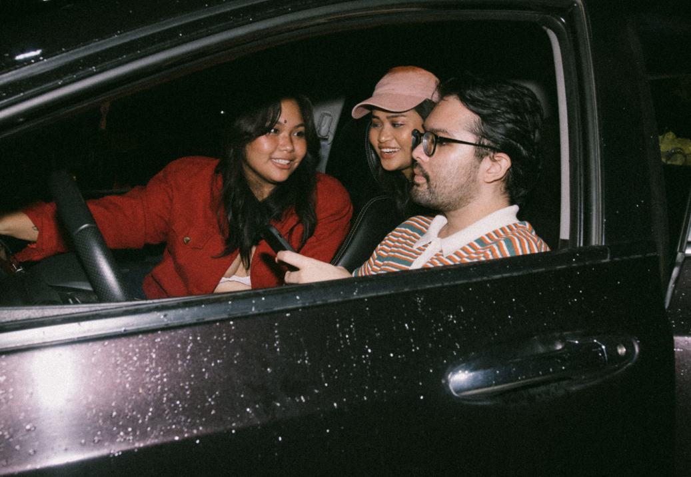
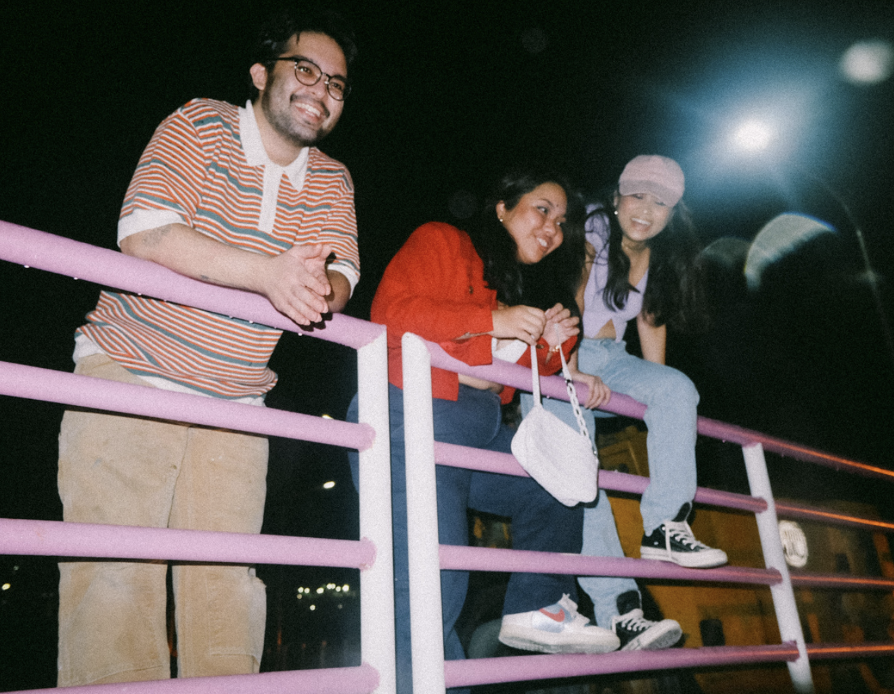
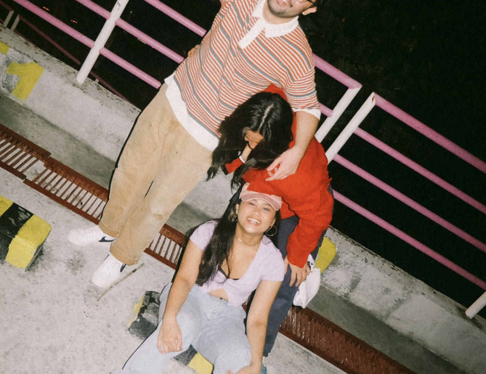
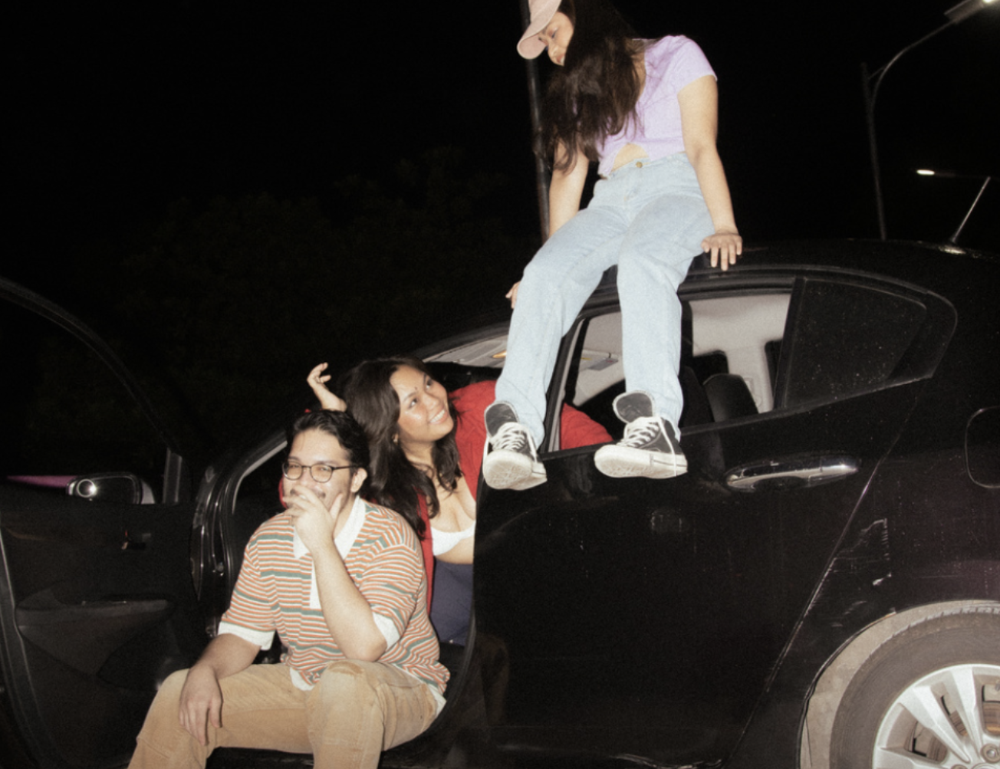
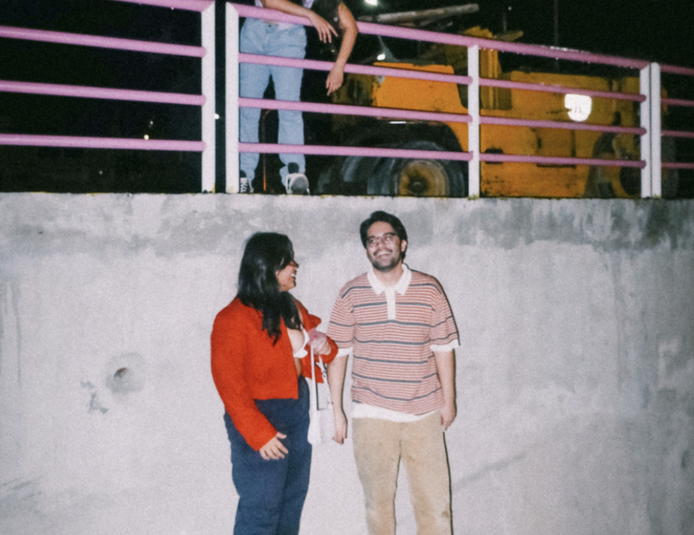

# Project Documentation for Rylan Hatfield

## Project Summery

Hello my name is Rylan Hatfield
I contributed to this website by adding slide transitions into the html, css, and the javascript. The slide animations change every 3 seconds, you can also use the left and right arrows on the screen to change the images yourself. The arrows change colors or highlights when you take your cursor and hover over the arrow. I think that this slide animation I implemented makes the website look more clean and modern. I also implemented the websites logo on the tab so you can easily find the web page if you have multiple tabs open on Google.

## Code Descriptions

> Code example 1: I made the slide carousel change pictures with the arrows and making it change automatically every 3 seconds

```js
const buttons = document.querySelectorAll("[data-carousel]");

buttons.forEach((button) => {
  button.addEventListener("click", () => {
    const offset = button.dataset.carouselButton === "next" ? 1 : -1;
    changeSlide(offset);
  });
});

function changeSlide(offset) {
  const carousel = document.querySelector("[data-carousel");
  const slides = carousel.querySelector("[data-slides]");
  const activeSlide = slides.querySelector("[data-active]");
  let newIndex = [...slides.children].indexOf(activeSlide) + offset;
  if (newIndex < 0) newIndex = slides.children.length - 1;
  if (newIndex >= slides.children.length) newIndex = 0;

  slides.children[newIndex].dataset.active = true;
  delete activeSlide.dataset.active;
}

setInterval(() => {
  changeSlide(1);
}, 2000);
```

> Code example 2: I used HTML to add a logo on the left side of the tab so you can navigate it easier, I also used HTML to add the picture links and the arrows on the carousel

```html
  <link rel="icon" type="image/x-icon" href="./assets/logo.PNG" />


      <section aria-label="Newest Photos">
      <div class="carousel" data-carousel>
        <i class="fa-solid fa-chevron-left carousel-button prev" data-carouselButton="prev"></i>
        <!-- <button class="carousel-button prev" data-carousel-button>
      &#10502;
    </button> -->
        <i class="fa-solid fa-chevron-right carousel-button next" data-carouselButton="next"></i>
        <!-- <button class="carousel-button next" data-carousel-button>
      &#10503; -->
        </button>
        <ul data-slides>
          <li class="slide" data-active>
            
          </li>
          <li class="slide">
            
          </li>
          <li class="slide">
            
          </li>
          <li class="slide">
            
          </li>
          <li class="slide">
            
          </li>
          <li class="slide">
            
          </li>
        </ul>
      </div>
    </section>


```

> Code example 3: The css I implemented styles how I would like the carousel page to look. It's also the same with the arrows I implemented with the page as well

```css
body {
  margin: 0;
  padding: 0;
}
*,
*::before,
*::after {
  box-sizing: border-box;
}

.carousel {
  width: 100vw;
  height: 100vh;
  /* loses the nav bar */
  position: relative;
}

.carousel > ul {
  margin: 0;
  padding: 0;
  list-style: none;
}

.slide {
  /* loses the nav bar */
  position: absolute;
  inset: 0;
  opacity: 0;
  transition: 200ms opacity ease-in-out;
  transition-delay: 200ms;
  /* slide animations */
  animation: slide 20s infinite;
}

.slide > img {
  display: block;
  width: 100%;
  height: 100%;
  object-fit: cover;
  object-position: center;
}

.slide[data-active] {
  opacity: 1;
  z-index: 1;
  transition-delay: 0ms;
}

.carousel-button {
  position: absolute;
  z-index: 2;
  background: none;
  border: none;
  font-size: 4rem;
  top: 50%;
  transform: translateY(-50%);
  color: rgb(204, 37, 18);
  cursor: pointer;
  border-radius: 0.25rem;
  padding: 0 0.5rem;
  background-color: rgba(0, 0, 0, 0.1);
}

.carousel-button:hover,
.carousel-button:focus {
  color: red;
  background-color: rgba(0, 0, 0, 0.2);
}

.carousel-button:focus {
  outline: 1px solid black;
}

.carousel-button.prev {
  left: 1rem;
}

.carousel-button.next {
  right: 1rem;
}

.column1 {
  float: left;
  width: 33.33%;
  padding: 5px;
}
```
